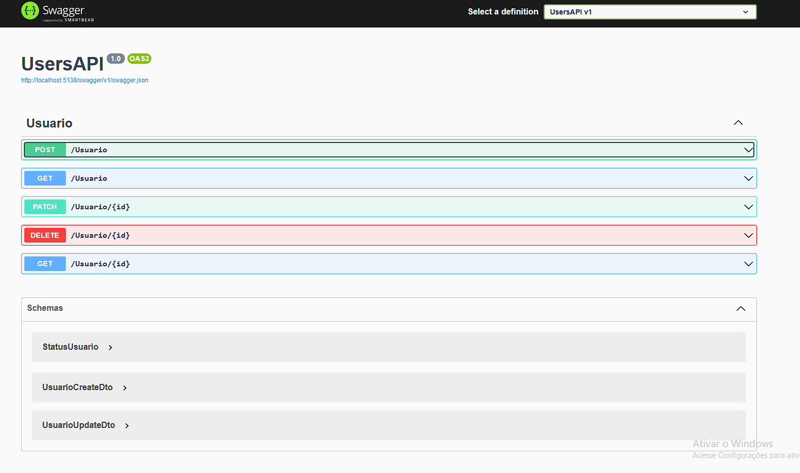
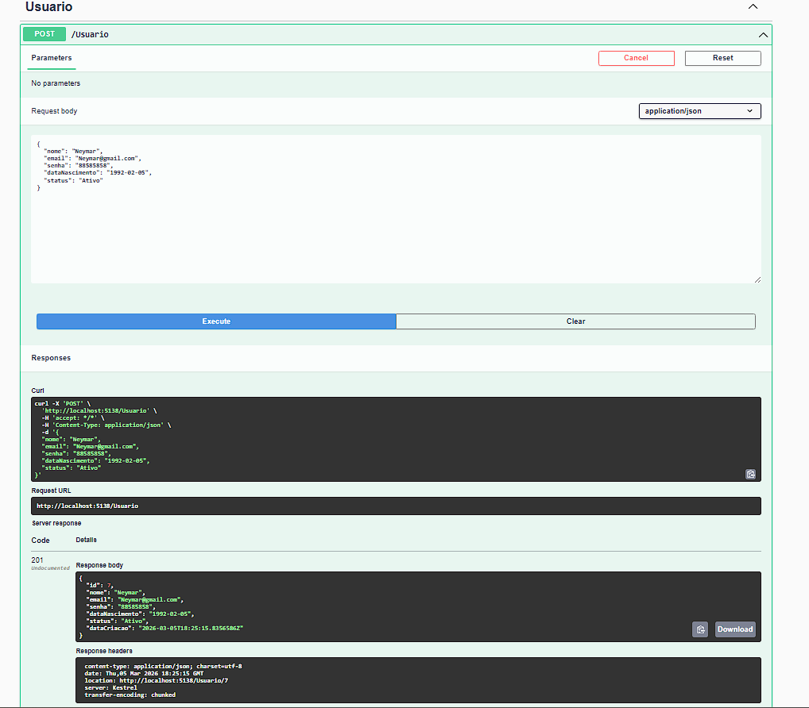
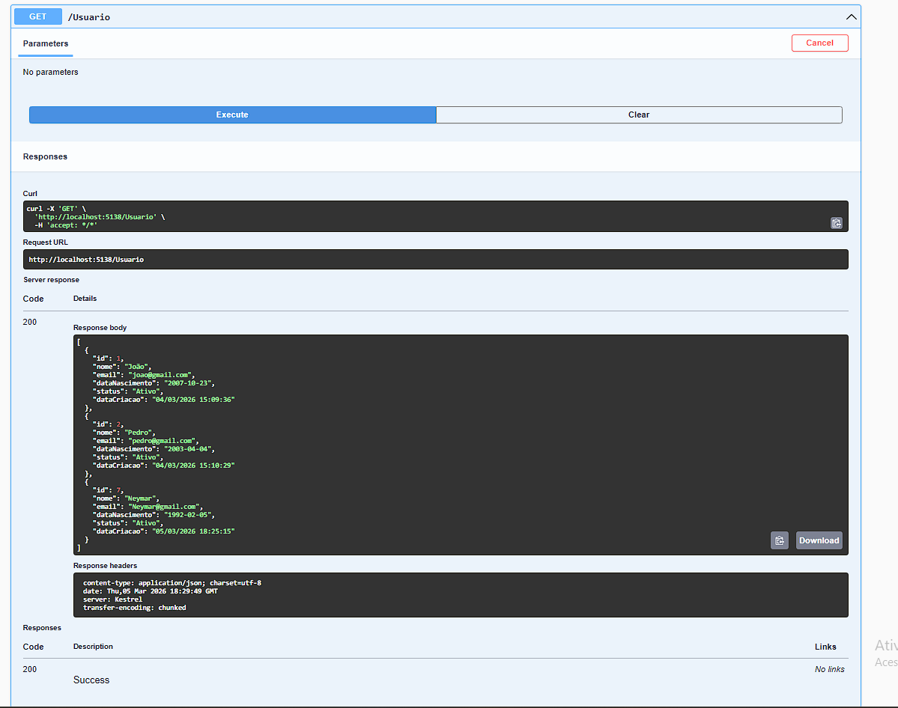
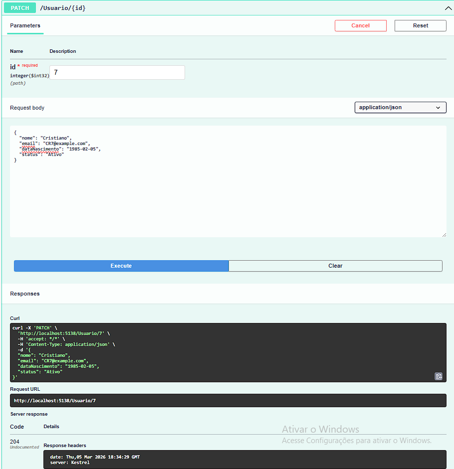
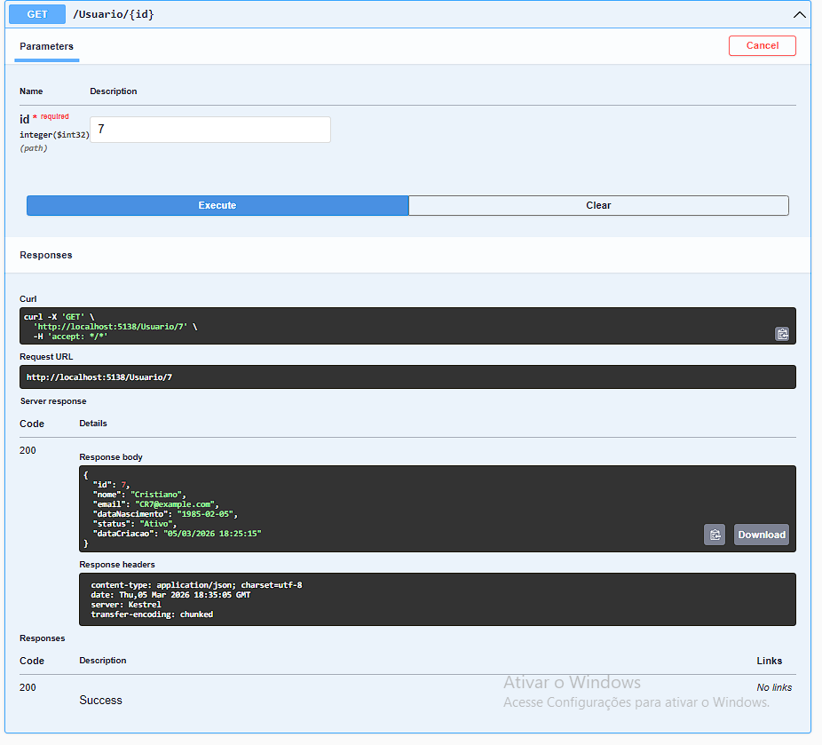
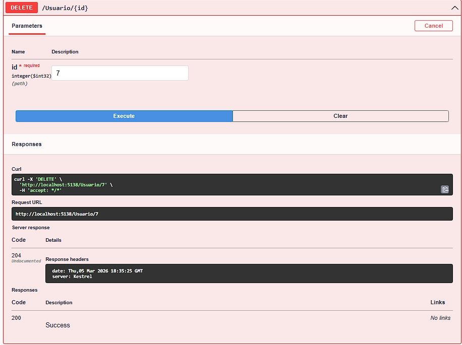

# Users API - .NET 8

API REST desenvolvida em **.NET 8** para gerenciamento de usuários.  
O projeto foi criado com o objetivo de praticar conceitos fundamentais de desenvolvimento **Back-end**, organização de código e boas práticas na construção de APIs.

## 🎯 Objetivo do Projeto

Este projeto foi desenvolvido para praticar:

- Construção de APIs REST
- Arquitetura em camadas
- Uso de DTOs
- Validação de dados
- Boas práticas de retorno HTTP
- Organização de código em projetos Back-end
- Versionamento com Git e GitHub

## 🚀 Tecnologias Utilizadas

- C#
- .NET 8
- ASP.NET Core
- Swagger
- LINQ
- Git
- GitHub

## 📂 Estrutura do Projeto

O projeto foi organizado de forma simples para separar responsabilidades:

- **Controllers** → Responsáveis pelos endpoints da API  
- **Services** → Contêm a lógica de negócio  
- **Models** → Representação das entidades do sistema  
- **DTOs** → Objetos utilizados para entrada e saída de dados  
- **Validations** → Regras de validação dos dados recebidos

## 📌 Funcionalidades

A API permite realizar operações básicas de gerenciamento de usuários:

- Criar usuário
- Listar usuários
- Buscar usuário por ID
- Atualizar usuário
- Deletar usuário

## 📡 Endpoints

| Método | Endpoint | Descrição |
|------|------|------|
| POST | /usuario | Criar um novo usuário |
| GET | /usuario | Listar todos os usuários |
| GET | /usuario/{id} | Buscar usuário por ID |
| PATCH | /usuario/{id} | Atualizar dados do usuário |
| DELETE | /usuario/{id} | Remover usuário |

## 📑 Documentação da API

Ao executar o projeto, a documentação interativa estará disponível através do **Swagger**.

## 🖥️ Demonstração da API

### Swagger

### Criar Usuário

### Listar Usuários

### Atualizar Usúario

### Buscar Por ID

### Deletar Usúario

## 📚 Aprendizados

Durante o desenvolvimento deste projeto foram praticados conceitos importantes como:

- Estruturação de APIs REST
- Separação de responsabilidades
- Manipulação de dados com DTOs
- Validação de dados de entrada
- Uso de serviços para regras de negócio

## 📌 Próximas Melhorias

Algumas melhorias que podem ser adicionadas no futuro:

- Implementação de autenticação com JWT
- Integração com banco de dados
- Paginação de resultados
- Camada de Repository
- Desenvolvimento de um front-end utilizando React

## 👨‍💻 Autor

João Matheus do Nascimento Silva

Estudante de **Técnico em Desenvolvimento de Sistemas** e desenvolvedor **Back-end .NET em formação**.
